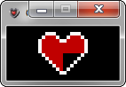
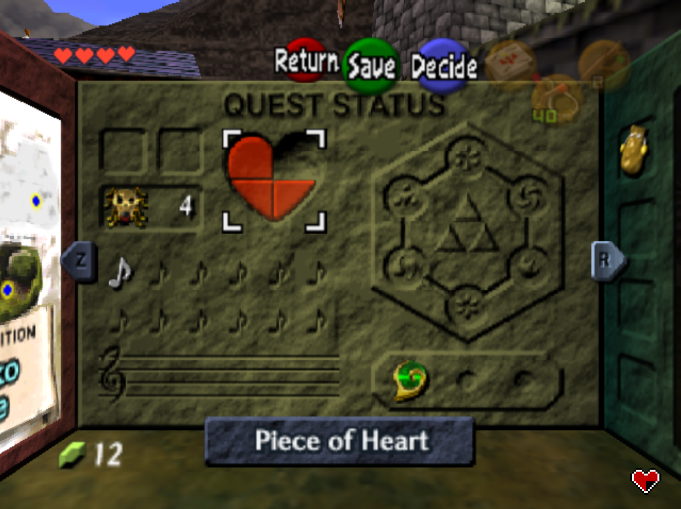
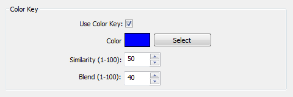

#  OOT Heart Piece Display 

Heart Piece Display for Zelda Ocarina of Time written in Python.
Mainly intended for streaming or just for fun. Similar to
[OOT Skulltula Counter](https://kraftydinosaur.github.io/projects/skulltula/).
Automatically obtains heart piece value from the running
**Mupen64** process.

Only tested to work with
[mupen64-rr v8](https://code.google.com/p/mupen64-rr/mupen64-rr).

## Open Broadcaster Software

Works well with [Open Broadcaster Software(OBS)](https://obsproject.com/).

Just change the background in your **user.conf** file to a color. Then
use OBS's **color key** function and select the same color:  

  

## Configuration

You should not edit the **"default.conf"** file. Instead you
should duplicate the file and rename the new file to **"user.conf"**.

| Name            | Default       | Description                                                                                  |
| ----------------| ------------- | -------------------------------------------------------------------------------------------- |
| BackgroundColor | **#000**      | Sets the background of the application. Useful for blending on streams.                      |
| UpdateInterval  | **100**       | Amount of time (in milliseconds) that the program waits before checking Mupen64 for changes. |
| hpAddress       | **0xA062B7**  | Memory address of heart piece value. Varies depending on OOT version. See below for details.   |

### Heart Piece Addresses

| Version   | Address      |
| --------  | ------------ |
| NTSC v1.0 | N/A |
| NTSC v1.1 | **0xA062B7** |
| NTSC v1.2 | N/A |
| PAL v1.0  | N/A |
| PAL v1.1  | N/A |

**Japanese and North American regions use NTSC, while Europe uses PAL.**

**If the address for your rom version is not available, just ask.
Alternatively you can use a program such as [MHS](http://memoryhacking.com/download.php) to find the value yourself.**
